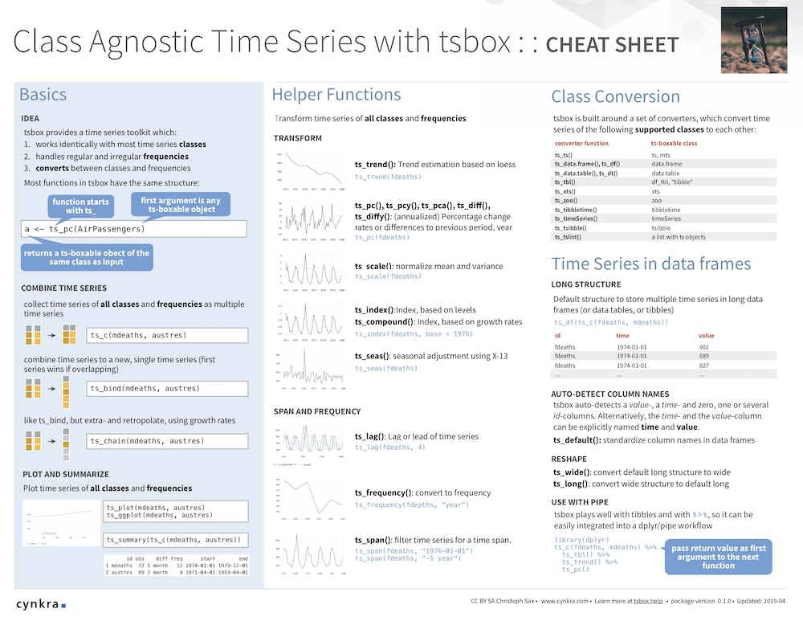

---
author:
- Christoph Sax
authors:
- Christoph Sax
categories:
- R
- time-series
date: 2019-04-10
excerpt: "The R ecosystem knows a vast number of time series classes:
  ts, xts, zoo, tsibble, tibbletime or timeSeries. The plethora of
  standards causes confusion. tsbox provides a set of tools that make it
  easy to switch between these classes."
layout: post
og_image: og_image.jpg
title: "tsbox 0.1: class-agnostic time series"
toc-title: Table of contents
---

The R ecosystem knows a vast number of time series classes: ts, xts,
zoo, tsibble, tibbletime or timeSeries. The plethora of standards causes
confusion. As different packages rely on different classes, it is hard
to use them in the same analysis. tsbox provides a set of tools that
make it easy to switch between these classes. It also allows the user to
treat time series as plain data frames, facilitating the use with tools
that assume rectangular data.


comic by `<a href = "https://xkcd.com/927/">`{=html}xkcd`</a>`{=html}


[The tsbox package](https://www.tsbox.help/) is built around a set of
functions that convert time series of different classes to each other.
They are frequency-agnostic and allow the user to combine multiple
non-standard and irregular frequencies. Because coercion works reliably,
it is easy to write functions that work identically for all classes. So
whether we want to smooth, scale, differentiate, chain-link, forecast,
regularize, or seasonally adjust a time series, we can use the same
tsbox-command for any time series class.

This blog gives a short overview of the changes introduced in 0.1. A
detailed overview of the package functionality is given in the
[documentation page](https://www.tsbox.help/) (or in a [previous
blog-post](https://www.cynkra.com/blog/2018-05-15-tsbox/)).

### Keeping explicit missing values

Version 0.1, now on [CRAN](https://cran.r-project.org/package=tsbox),
brings many bug fixes and improvements. A substantial change involves
the treatment of `NA` values in data frames. Previously, all `NA`s in
data frames were treated as implicit and were only made explicit by a
call to `ts_regular`.

This has changed now. If you convert a `ts` object to a data frame, all
`NA` values will be preserved. To replicate previous behavior, apply the
`ts_na_omit` function:

``` r
library(tsbox)
x.ts <- ts_c(mdeaths, austres)
x.ts
ts_df(x.ts)
ts_na_omit(ts_df(x.ts))
```

### `ts_span` extends outside of series span

This lays the groundwork for
[`ts_span`](https://www.tsbox.help/reference/ts_span.html) to be
extensible. With `extend = TRUE`, `ts_span` extends a regular series
with `NA` values, up to the specified limits, similar to base `window`.
Like all functions in tsbox, this is frequency-agnostic. For example, in
the following, the monthly series `mdeaths` is extended by monthly `NA`
values, while the quarterly series `austres` is extended by quarterly
`NA` values.

``` r
x.df <- ts_df(ts_c(mdeaths, austres))
ts_span(x.df, end = "1999-12-01", extend = TRUE)
```

### `ts_default` standardizes column names in a data frame

In rectangular data structures, i.e., in a `data.frame`, a `data.table`,
or a `tibble`, tsbox stores one or multiple time series in the 'long'
format. By default, tsbox detects a *value*, a *time* and zero, one or
several *id* columns. Alternatively, the time column and the value
column can be explicitly named `time` and `value`. If explicit names are
used, the column order will be ignored.

While automatic column name detection is useful in interactive mode, it
produces unnecessary overhead in longer workflows. The helper function
[`ts_default`](https://www.tsbox.help/reference/ts_default.html) detects
and renames the time and the value column so that auto-detection will be
turned off in subsequent steps (note that the names of the id columns
are not affected):

``` r
x.df <- ts_df(ts_c(mdeaths, austres))
names(x.df) <- c("a fancy id name", "date", "count")
ts_plot(x.df)  # tsbox is fine with that
ts_default(x.df)
```

### `ts_summary` summarizes time series

[`ts_summary`](https://www.tsbox.help/reference/ts_summary.html)
provides a frequency agnostic summary of a ts-boxable object:

``` r
ts_summary(ts_c(mdeaths, austres))
#>        id obs    diff freq      start        end
#> 1 mdeaths  72 1 month   12 1974-01-01 1979-12-01
#> 2 austres  89 3 month    4 1971-04-01 1993-04-01
```

`ts_summary` returns a plain data frame that can be used for any
purpose. It is also recommended for the extraction of various time
series properties, such as `start`, `freq` or `id`:

``` r
ts_summary(austres)$id
#> [1] "austres"
ts_summary(austres)$start
#> [1] "1971-04-01"
```

### And a cheat sheet!

Finally, we fabricated a tsbox cheat sheet that summarizes most
functionality. Print and enjoy working with time series.


