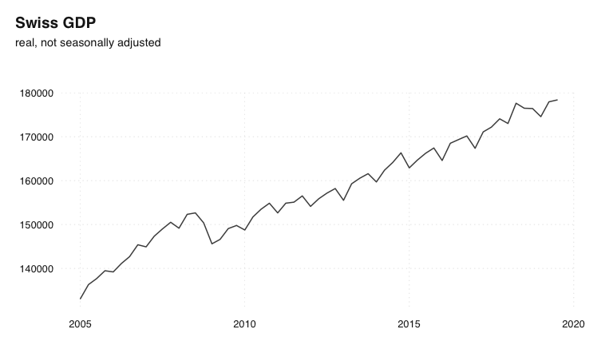
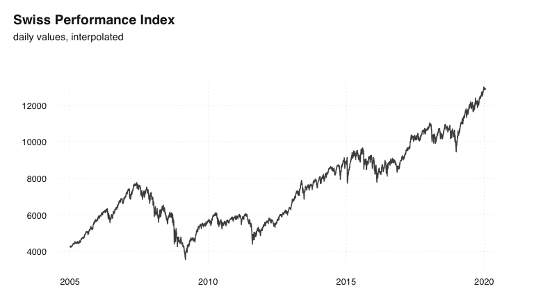
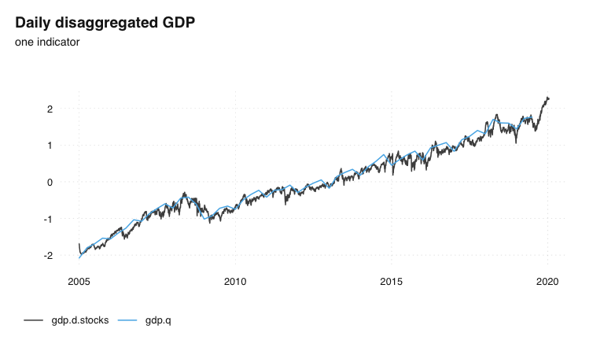

---
author:
- Christoph Sax
authors:
- Christoph Sax
categories:
- R
- time-series
date: 2020-02-09
excerpt: Not having a time series at the desired frequency is a common
  problem for researchers and analysts. With the help of one or more
  high-frequency indicator series, the low-frequency series may be
  disaggregated into a high-frequency series.
image: banner.jpg
layout: post
og_image: og_image.jpg
title: "tempdisagg: converting quarterly time series to daily"
toc-title: Table of contents
---

Not having a time series at the desired frequency is a common problem
for researchers and analysts. For example, instead of quarterly sales,
they only have annual sales. Instead of a daily stock market index, they
only have a weekly index. While there is no way to fully make up for the
missing data, there are useful workarounds: with the help of one or more
high-frequency indicator series, the low-frequency series may be
disaggregated into a high-frequency series.


Photo by Jordan McDonald


The package tempdisagg implements the standard methods for temporal
disaggregation: Denton, Denton-Cholette, Chow-Lin, Fernandez and
Litterman. Our article on [temporal disaggregation of time
series](https://doi.org/10.32614/RJ-2013-028) in the R-Journal describes
the package and the theory of temporal disaggregation in more detail.

The package has been around for eight years, enabling the standard year
or quarter to month or quarter disaggregation. With version 1.0, there
are now some major new features: disaggregation can be performed from
any frequency to any frequency. Also, tempdisagg now supports time
series classes other than `ts`.

### Convert between any frequency

tempdisagg can now convert between most frequencies, for example, it can
disaggregate a monthly series to daily. It is no longer restricted to
regular conversions, where each low-frequency period had the same number
of high-frequency periods. Instead, a low-frequency period (e.g. month)
can contain any number of high-frequency periods (e.g. 31, 28 or 29
days). Thanks to Roger Kissling and Stella Sim who have suggested this
idea.

We can not only convert months to days, but also years to days, weeks to
seconds, or academic years to seconds, or lunar years to hours,etc. The
downside is that the computation time depends on the number of
observations. Thus, for longer high-frequency series, the computation
may take a while.

In the following, we try to disaggregate quarterly GDP of Switzerland to
a hypothetical daily GDP series. The example series are shipped with the
package.

``` r
library(tempdisagg)
data(tempdisagg)
head(gdp.q)
##         time    value
## 1 2005-01-01 133101.3
## 2 2005-04-01 136320.4
## 3 2005-07-01 137693.7
## 4 2005-10-01 139475.9
## 5 2006-01-01 139204.7
## 6 2006-04-01 141112.5
```

## Time series can be stored in data frames

Because we are dealing with daily data, we keep the data in a
`data.frame`, rather than in a `ts` object. Other time series objects,
such as `xts` and `tsibble`, are possible as well. For conversion and
visualization, we use the [tsbox](https://www.tsbox.help) package.

``` r
library(tsbox)
ts_plot(gdp.q, title = "Swiss GDP", subtitle = "real, not seasonally adjusted")
```


Series to disaggregate: quarterly gross domestic product of Switzerland


## Disaggregation to daily frequency

While disaggregation can also be performed without other series, we use
Swiss stock market data as an indicator series to disaggregate GDP. Data
of the stock market index, the SMI, is also included in tempdisagg.
Weekend and holiday values have been interpolated, because `td` does not
allow the presence of missing values.

``` r
ts_plot(spi.d, title = "Swiss Performance Index", subtitle = "daily values, interpolated")
```


Daily indicator series: Swiss Performance Index


The following uses the Chow-Lin method to disaggregate the series. A
high *rho* parameter takes into account that the two series are unlikely
to be co-integrated.

``` r
m.d.stocks <- td(gdp.q ~ spi.d, method = "chow-lin-fixed", fixed.rho = 0.9)
summary(m.d.stocks)
##
## Call:
## td(formula = gdp.q ~ spi.d, method = "chow-lin-fixed", fixed.rho = 0.9)
##
## Residuals:
##    Min     1Q Median     3Q    Max
## -10656  -1760   1076   3796   8891
##
## Coefficients:
##              Estimate Std. Error t value Pr(>|t|)
## (Intercept) 1.320e+03  2.856e+01   46.22   <2e-16 ***
## spi.d       5.512e-02  3.735e-03   14.76   <2e-16 ***
## ---
## Signif. codes:  0 '***' 0.001 '**' 0.01 '*' 0.05 '.' 0.1 ' ' 1
##
## 'chow-lin-fixed' disaggregation with 'sum' conversion
## 59 low-freq. obs. converted to 5493 high-freq. obs.
## Adjusted R-squared: 0.7928 AR1-Parameter:   0.9
```

And here is the result: A daily series of GDP

``` r
gdp.d.stocks <- predict(m.d.stocks)
ts_plot(
  ts_scale(
    ts_c(gdp.d.stocks, gdp.q)
  ),
  title = "Daily disaggregated GDP",
  subtitle = "one indicator"
)
```


Swiss GDP, disaggregated to daily


Like with all disaggregation methods in tempdisagg, the resulting series
fulfills the aggregation constraint (the resulting series is as long as
the indicator, and needs to be shortened for a comparison):

``` r
all.equal(
  ts_span(
    ts_frequency(gdp.d.stocks, "quarter", aggregate = "sum"),
    end = "2019-07-01"
  ),
  gdp.q
)
## [1] TRUE
```
