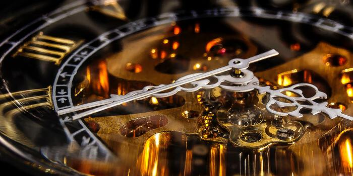

---
author:
- Christoph Sax
authors:
- Christoph Sax
badges:
- bg: bg-warning
  label: CRAN
categories:
- R
- time-series
date: 2021-09-18
excerpt: The tsbox package provides a set of tools that are agnostic
  towards existing time series classes. The tools also allow you to
  handle time series as plain data frames, thus making it easy to deal
  with time series in a dplyr or data.table workflow.
image: banner.jpg
layout: post
og_image: og_image.jpg
title: "tsbox 0.3.1: extended functionality"
toc-title: Table of contents
---

[The tsbox package](https://www.tsbox.help/) provides a set of tools
that are agnostic towards existing time series classes. The tools also
allow you to handle time series as plain data frames, thus making it
easy to deal with time series in a dplyr or data.table workflow.


Photo by James Sutton

Version 0.3.1 is now on CRAN and provides several bugfixes and
extensions (see
[here](https://cran.r-project.org/web/packages/tsbox/news/news.html) for
the full change log). A detailed overview of the package functionality
is given in the [documentation page](https://www.tsbox.help/) (or in an
[older blog-post](https://www.cynkra.com/blog/2018-05-15-tsbox/)).

## New and extended functionality

-   [`ts_frequency()`](https://www.tsbox.help/reference/ts_frequency.html):
    changes the frequency of a time series. It is now possible to
    aggregate any time series to years, quarters, months, weeks, days,
    hours, minutes or seconds. For low- to high-frequency conversion,
    the
    [tempdisagg](https://cran.r-project.org/web/packages/tempdisagg/index.html)
    package can now [convert low frequency to high
    frequency](https://cran.r-project.org/web/packages/tempdisagg/vignettes/hf-disagg.html)
    and has support for ts-boxable objects. E.g.:

    ``` r
    library(tsbox)
    x <- ts_tbl(EuStockMarkets)
    x
    #> # A tibble: 7,440 × 3
    #>   id    time                 value
    #>   <chr> <dttm>               <dbl>
    #> 1 DAX   1991-07-01 03:18:27  1629.
    #> 2 DAX   1991-07-02 13:01:32  1614.
    #> 3 DAX   1991-07-03 22:44:38  1607.
    #> 4 DAX   1991-07-05 08:27:43  1621.
    #> 5 DAX   1991-07-06 18:10:48  1618.
    #> # … with 7,435 more rows

    ts_frequency(x, "week")
    #> # A tibble: 1,492 × 3
    #>   id    time        value
    #>   <chr> <date>      <dbl>
    #> 1 DAX   1991-06-30  1618.
    #> 2 DAX   1991-07-07  1633.
    #> 3 DAX   1991-07-14  1632.
    #> 4 DAX   1991-07-21  1620.
    #> 5 DAX   1991-07-28  1616.
    #> # … with 1,487 more rows
    ```

-   [`ts_index()`](https://www.tsbox.help/reference/ts_index.html):
    returns an indexed series, with a value of 1 at the base period.
    This base period can now be specified more flexibly. E.g., the
    average of a year can defined as 1 (which is a common use case).

-   [`ts_na_interpolation()`](https://www.tsbox.help/reference/ts_examples.html):
    A new function that wraps `imputeTS::na_interpolation()` from the
    [imputeTS](https://steffenmoritz.github.io/imputeTS/) package and
    allows the imputation of missing values for any time series object.

-   [`ts_first_of_period()`](https://www.tsbox.help/reference/ts_first_of_period.html):
    A new function that replaces the date or time value by the first of
    the period. This is useful because tsbox usually relies on
    timestamps being the first of a period. The following monthly series
    has an offset of 14 days. `ts_first_of_period()` changes the
    timestamp to the first date of each month:

    ``` r
    x <- ts_lag(ts_tbl(mdeaths), "14 days")
    x
    #> # A tibble: 72 × 2
    #>   time       value
    #>   <date>     <dbl>
    #> 1 1974-01-15  2134
    #> 2 1974-02-15  1863
    #> 3 1974-03-15  1877
    #> 4 1974-04-15  1877
    #> 5 1974-05-15  1492
    #> # … with 67 more rows

    ts_first_of_period(x)
    #> # A tibble: 72 × 2
    #>   time       value
    #>   <date>     <dbl>
    #> 1 1974-01-01  2134
    #> 2 1974-02-01  1863
    #> 3 1974-03-01  1877
    #> 4 1974-04-01  1877
    #> 5 1974-05-01  1492
    #> # … with 67 more rows
    ```

## Convert everything to everything

[tsbox](https://www.tsbox.help/) is built around a set of converters,
which convert time series stored as
[ts](https://rdrr.io/r/stats/ts.html),
[xts](https://cran.r-project.org/package=xts),
[data.frame](https://rdrr.io/r/base/data.frame.html),
[data.table](https://cran.r-project.org/package=data.table),
[tibble](http://tibble.tidyverse.org/),
[zoo](https://cran.r-project.org/package=zoo),
[tsibble](https://tsibble.tidyverts.org/),
[tibbletime](https://cran.r-project.org/package=tibbletime),
[tis](https://cran.r-project.org/web/packages/tis/index.html),
[irts](https://cran.r-project.org/package=tseries) or
[timeSeries](https://cran.r-project.org/package=timeSeries) to each
other:

``` r
library(tsbox)
x.ts <- ts_c(fdeaths, mdeaths)
x.xts <- ts_xts(x.ts)
x.df <- ts_df(x.xts)
x.dt <- ts_dt(x.df)
x.tbl <- ts_tbl(x.dt)
x.zoo <- ts_zoo(x.tbl)
x.tsibble <- ts_tsibble(x.zoo)
x.tibbletime <- ts_tibbletime(x.tsibble)
x.timeSeries <- ts_timeSeries(x.tibbletime)
x.irts <- ts_irts(x.tibbletime)
x.tis <- ts_tis(x.irts)
all.equal(ts_ts(x.tis), x.ts)
#> [1] TRUE
```

## Use same functions for time series classes

Because this works reliably, it is easy to define a toolkit that works
for all classes. So, whether we want to **smooth**, **scale**,
**differentiate**, **chain**, **forecast**, **regularize**, **impute**
or **seasonally adjust** a time series, we can use the same commands to
whatever time series class at hand:

``` r
ts_trend(x.ts)   # estimate a trend line
ts_pc(x.xts)     # calculate percentage change rates (period on period)
ts_pcy(x.df)     # calculate percentage change rates (year on year)
ts_lag(x.dt)     # lagged series
```

[There are many more](https://www.tsbox.help/reference/index.html).
Because they all start with `ts_`, you can use auto-complete to see
what's around. Most conveniently, there is a time series plot function
that works for all classes and frequencies:

``` r
ts_plot(
  `Airline Passengers` = AirPassengers,
  `Lynx trappings` = ts_tis(lynx),
  `Deaths from Lung Diseases` = ts_xts(fdeaths),
  title = "Airlines, trappings, and deaths",
  subtitle = "Monthly passengers, annual trappings, monthly deaths"
)
```


