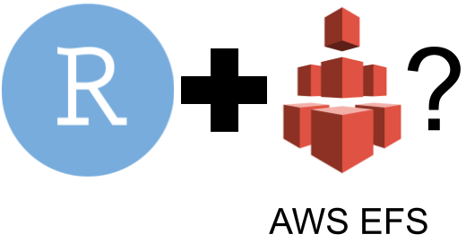
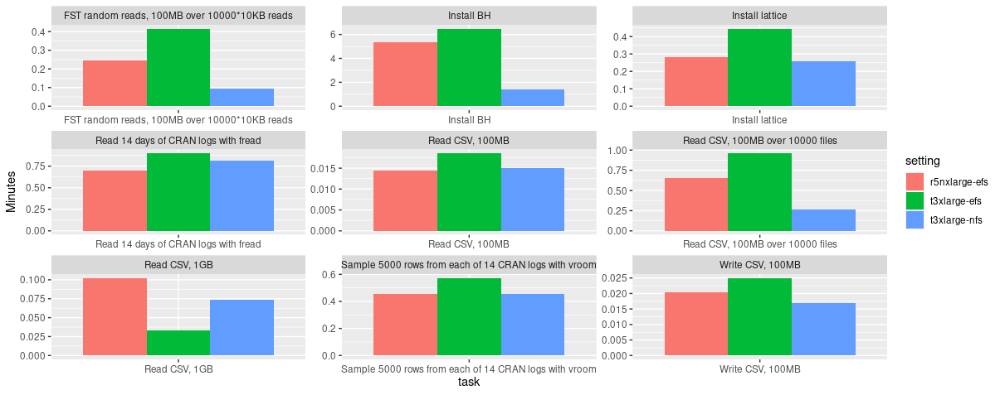
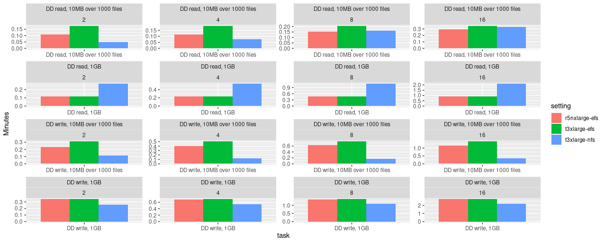
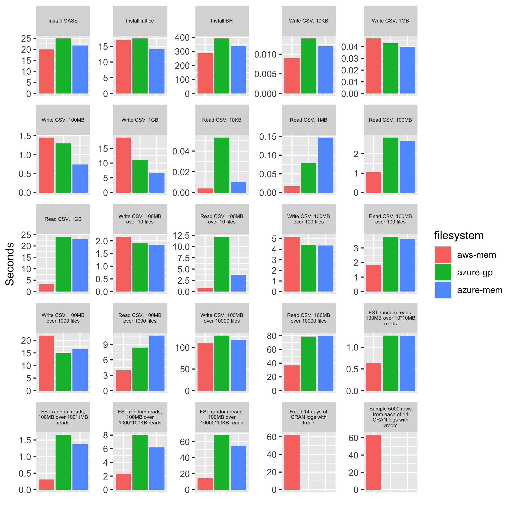

---
author:
- Patrick Schratz
authors:
- Patrick Schratz
avatar: /user/img/about/patrick2.jpg
badges:
- bg: bg-info
  label: DevOps
categories:
- DevOps
- Posit
- performance
date: 2022-09-14
excerpt: As a consulting company with a strong focus on R and Posit
  (formerly RStudio) products, we have gathered quite a bit of
  experience in configuration and deployment of Workbench and Connect
  products in the cloud. We would like to share some of these insights
  and shine some light on the file system debate around these
  applications.
image: banner.png
layout: post
og_image: banner.png
slug: rstudio-efs-nfs
title: "EFS vs. NFS for RStudio on Kubernetes (AWS): Configuration and
  considerations"
toc-title: Table of contents
---



As a consulting company with a strong focus on R and Posit (formerly
RStudio) products, we have gathered quite a bit of experience in
configuration and deployment of Workbench and Connect products in the
cloud. We would like to share some of these insights in the following
blog post and shine some light on the file system debate around these
applications. While the "how to" is very well outlined by various
RStudio/Posit resources
([1](https://github.com/rstudio/helm/tree/main/charts/rstudio-workbench),
[2](https://github.com/rstudio/helm/tree/main/charts/rstudio-connect),
[3](https://docs.rstudio.com/helm/rstudio-connect/kubernetes-howto/),
[4](https://support.rstudio.com/hc/en-us/articles/4414817033623-Mounting-your-RStudio-Workbench-Connect-Server-to-an-EFS-share)),
there's one important part of the setup which is actively debated among
system engineers: the choice and handling of the file system.

But let's start at the beginning: in the cloud, one has essentially two
choices for self-hosting RStudio applications: a single-instance
installation on a virtual machine or going with Kubernetes (k8s) for a
container-based, high-availability (HA) setup. The latter comes with
many benefits, both for users and administrators: HA ensures stability
of the service and allows for controlled upgrades, in the best case
without any interruption or downtime for users. Users profit from the
possible option of requesting CPU and memory resources as needed for
their analysis - assuming the k8s cluster runs with an autoscaler which
allows provisioning new worker nodes as needed. Potential downsides
could be an increased administration complexity, decreased file system
performance and eventually higher costs. Though these points cannot be
generalized and always depend on the cluster at hand, its purpose and
the team managing it.

## File systems - general

Users are in continuous contact with the file system even though most
are not actively thinking about it. Each time a file is read or written,
e.g., during the installation of an R package, the choice of the file
system matters. It determines

-   How fast the request is processed (latency)
-   How many bytes are transferred per seconds (throughput; might differ
    between read and write operations)
-   How many files can be processed at the same time (concurrency)

To understand the following discussion about [Elastic File System
(EFS)](https://aws.amazon.com/efs/) and [Network File System
(NFS)](https://en.wikipedia.org/wiki/Network_File_System) (including
explanations about both), a bit of background is needed how read/write
operations can generally be categorized.

### Read-write-once (RWO), read-only-many (ROX) and read-write-many (RWX) file systems

Applications running on on-premise machines or single cloud instances
usually read and write to a read-write-once (RWO) file system. The
"once" here means that this specific file system can only be attached to
one instance. Read-only-many (ROX) allows multiple instances to attach a
volume but only for reading - only one instance is allowed to mount it
in read-write mode. Given their restriction on a single mount point, RWO
file systems are usually faster than ROX or RWX. However, RWO comes with
the following limitations for HA usage:

-   they can only operate in a single AZ (i.e., an RWO volume can only
    be mounted by a node in the same zone) and this one must match the
    instance's AZ
-   they cannot be used in (real) high-availability setups as this
    usually requires pods to run on different nodes - and RWO file
    systems can only be mounted by a single node

File systems which support read-write-many (RWX) operations allow the
attachment by multiple instances, usually across availability zones.
They usually have a central (remote) address which can be used to mount
them into an instance. This allows for a central deployment of RWX
providers on standalone machines.

NOTE1: Availability zones in the cloud are discrete data centers with
redundant power, networking, and connectivity in a certain region.
Issues appearing in one particular zone do not affect others. Their main
purpose of different AZs is to increase reliability.

NOTE2: There's also read-write-once-pod (RWOP) which means that only one
pod on a certain node can read/write to a volume. This is only supported
for CSI volumes and k8s \> 1.22
[\[source\]](https://stackoverflow.com/a/71046870/4185785).


*[Image
source](https://duckduckgo.com/?q=kubernetes+efs+memes&iar=images&iax=images&ia=images&iai=https%3A%2F%2Fwww.unlockyourbrain.bzh%2Fwp-content%2Fuploads%2F2020%2F09%2F1zm5Yf4QPuoV1KtnECUhsRQ.jpeg)*

## Kubernetes high-availability and NFS server

To allow for high-availability (HA) in k8s installations, an individual
HA-pod needs to communicate with the respective others and access the
same files. As the load is usually balanced across replicas, this
requires a file system which allows for multiple r/w mounts, i.e., a RWX
one.

This is also the case for RStudio applications in HA configuration.
There are multiple options for RWX file systems. The most common one,
which is also used in many custom multi-server on-premise environments,
is [NFS](https://en.wikipedia.org/wiki/Network_File_System).

While NFS is great, well known and fast, it is not so easy to make use
of it in the cloud, especially in isolated environments like k8s
clusters. On AWS, there is no default k8s support for NFS and hence one
needs to deploy their own NFS server which serves as the central access
point for mount requests. (An NFS server could in theory live anywhere,
as long as it's reachable by the cluster nodes.)

There's an official [NFS
Ganesha](https://github.com/nfs-ganesha/nfs-ganesha) provider within the
`kubernetes-sigs` (SIG = special-interest-group) [organization on
GitHub](https://github.com/kubernetes-sigs/nfs-ganesha-server-and-external-provisioner).
However, it does not support HA and we are not aware of any other one
which does. Hence, the NFS server within a k8s cluster is usually
provided by a single pod. This comes with some severe implications: all
pods which rely on some NFS mounts are dependent on this single NFS pod.
If the NFS pod gets recreated for some reason (e.g., because its being
moved to a different node or the deployment is updated), all pods which
a NFS mount will be unable to read and write data until the new node has
attached the NFS volume again (which is usually still bound to the old
node for \~ 5 min).

This is a pivotal and tricky issue: the pod health of a pod making use
of an NFS mount does not necessarily depend on the NFS mount *once its
running*. This means if the NFS server pod is down (for whatever
reason), dependent deployments appear as "healthy" to the cluster
(admins) but the users will fail to read and write data.

The number of times a pod gets recreated/restarted/moved on a cluster
depends on multiple factors:

-   How often are the individual nodes recreated?
-   Who is responsible for scheduling pods to individual nodes?
-   Are nodes running on permanent/reserved instances or on SPOT
    instances (an AWS-only term for cheaper nodes which can be reclaimed
    any time) which are more often reclaimed/recreated by the cloud
    provider?

### Our experiences with NFS on Kubernetes

We at cynkra started out with an NFS server for hosting RStudio
applications on a k8s cluster, mainly because existing guides suggested
doing so and warn using EFS. Judging from our experiences on a 3-5 node
cluster on AWS with a self-managed autoscaler and node refresh enabled
(which means that nodes get replaced frequently, e.g., whenever a new
machine image is available), we have seen the NFS pod getting relocated
every few days/weeks. Often this caused the mentioned problems above,
i.e., RSC and/or RSW not being able to use due to stale file handles or
other r/w issues. If the NFS server ran in an HA setup, this task would
be completely trouble-free as the other pods would take over the
incoming requests. However, in a non-HA deployment, this causes
potentially unwanted downtime for multiple dependent applications.

While there are ways in k8s to reduce/avoid the automatic recreation of
non-HA pods, serving content on a k8s cluster usually comes with the
philosophy of being able to move/recreate every pod in the cluster
without immediate consequences. Yet the fact that this seems impossible
(as of right now) for an NFS server deployment represents a constant
stability risk. It makes the HA deployments of all RStudio services
essentially meaningless as they would all fail once the NFS pod would be
down.

One could also host the NFS server outside of the cluster on a normal VM
which does not reboot that frequently and does not recreate the NFS
server service. However, this would mean opening up the k8s network to
include this machine and eventually hosting a dedicated machine only for
the NFS server. This approach would also not solve the potential
bottleneck issues - whenever this machine needs a reboot, all dependent
services would face some downtime. In addition, this approach would not
be multi-AZ capable because the private subnets, which are used for a
fast and secure connection between the nodes, do not support this -
private subnets can only operate within a single AZ. A k8s cluster is
essentially about two things: high-availability and scalability. Adding
a static, non-scalable component (= remote NFS server) which acts as a
dependency for many services, into the cluster contradicts with this
principle.

The main happenings which made us overthink our current setup was seeing
spurious behavior after NFS pod recreations: with both the NFS pods and
the RStudio pods in a healthy state, sometimes 'stale file handle'
issues occurred for users when trying to write data. RSC was not able to
serve content as it could not read data anymore. All of these were
issues detected by users and reported to the responsible engineers
(i.e., us) - which is exactly what engineers try to avoid at all cost.
The issue could often be solved by simply recreating the RSC pod, which
then triggered a fresh reconnection to the NFS server. We assume this
behavior to most likely be a regression caused by a previous NFS pod
relocation.

It was time to look into alternatives. Since some years, most cloud
providers offer their own, cloud-based RWX file systems. These claim to
be very flexible in the way that they are available for mounts in all
AZs. Cluster admins only need to configure a driver (which allows to
define certain mount options) but the file system itself is hosted by
the cloud provider in an HA setting. AWS calls it EFS (elastic file
system), on Azure it's called "azure files." Google does not provide a
native RWX solution (only ROX) and one is [required to use a
self-managed NFS server for
RWX](https://medium.com/@Sushil_Kumar/readwritemany-persistent-volumes-in-google-kubernetes-engine-a0b93e203180).

Since we are on AWS, we thought about giving EFS, the native AWS
multi-AZ RWX offering, a try. We were aware of the warnings given out by
RStudio about [possible performance
issues](https://docs.rstudio.com/rstudio-team/integration/efs/).
Luckily, we were not the first ones to try EFS with RStudio products.
The RStudio engineers already wrote an article about RStudio
applications with EFS, especially targeting the performance topic (see
linked article).

Besides the higher price (around 3x) of EFS compared to EBS (elastic
block storage = default RWO file system), which is used behind the
scenes by an NFS server deployment, EFS is somewhat lacking in
performance compared to NFS. The following figures show some file system
benchmark results which we have carried out on different instance types.
Network-optimized instance types (`r5n` on AWS) [were said to improve
EFS performance](https://docs.rstudio.com/rstudio-team/integration/efs/)
which is backed up by our results.

 *Fig. 1: Sequential benchmarking results of
EFS (executed on `r5n.xlarge` and `t3.xlarge` instances) and NFS
(executed on a `t3.xlarge` instance). Benchmark source:
[rstudio/fsbench](https://github.com/rstudio/fsbench).*

Apparently, one of the main reasons (according to discussions on the
web) is that EFS is used by many people around the world and needs to
split its available resources dynamically across all clients. There are
ways to increase performance (e.g., by selecting a different mode,
increasing the size of the file system or tweaking certain mount
options). However, in the end EFS will always stay slower than NFS.

 *Fig. 2: Parallel benchmarking results of EFS
(executed on `r5n.xlarge` and `t3.xlarge` instances) and NFS (executed
on an `t3.xlarge` instance). Benchmark source:
[rstudio/fsbench](https://github.com/rstudio/fsbench).*

We've also compared Azure's [Azure Files
NFS](https://docs.microsoft.com/en-us/azure/storage/files/files-nfs-protocol)
offering to AWS EFS using the
[fsbench](https://github.com/rstudio/fsbench) tool from RStudio. At
first we were optimistic giving the higher maximum values reported for
the Azure NFS service. However, the benchmark results show a different
picture and do not encourage moving existing RStudio k8s deployments
from AWS to Azure.



*Fig. 3: Sequential benchmarking results of AWS EFS (**aws-mem** =
`r5n.large`) and Azure Files NFS (**azure-gp** = `D2s_v3`; **azure-mem**
= `E2bds_v5`). Benchmark source:
[rstudio/fsbench](https://github.com/rstudio/fsbench).*

Having compared NFS and EFS performance-wise now and given that file
system decisions are usually deliberate ones, the question for us was:
how much slower is it compared to NFS and do the upsides of EFS outweigh
it? After trying it out for ourselves, we concluded yes, the advantages
of EFS outweigh its decreased performance and we should use it as the
file system for our RStudio k8s clusters. With EFS, we

-   don't need to worry about a single NFS server deployment as a
    potential bottleneck
-   can more easily make use of multiple availability zones
-   have a file system which dynamically adjusts to storage use
    (expansion and shrinking)
-   eventually improves (in speed) over time

We are aware that users coming from a k8s-NFS or on-premise installation
will experience a reduced speed due to some increases in latency and
especially when working with many small files. However, these will only
be apparent for people coming from existing RSW installations and not
for ones starting out on a new cluster. Especially users coming from an
RSW on-premise installation will feel a substantial decrease in speed as
in such an environment usually a single-instance RSW runs on an RWO file
system (usually `ext4`) which is a completely different ballpark. FWIW,
AWS has also improved EFS latency in [February
2022](https://aws.amazon.com/blogs/aws/amazon-elastic-file-system-update-sub-millisecond-read-latency/),
making it more performant for existing and new customers at no
additional cost.

Another (important) point worth mentioning is that on AWS, bottlerocket
node images (more on that in a separate blog post) do not have native
support for NFS but work with EFS. This becomes of interest when
considering running a cluster on bottlerocket images or if the cluster
is already doing so.

## RStudio k8s clusters on EFS - Deployment

During our EFS evaluation period, we came across potential pitfalls and
other RStudio peculiarities which system admins need to be aware of when
aiming for a k8s RStudio cluster. These are described in the following.

Note: This section makes a few assumptions:

-   A k8s cluster on AWS
-   Full cluster admin permissions
-   RStudio Workbench and RStudio Connect "Enterprise" licenses
-   The use of `terraform` and the RStudio helm charts

First, we would like to refer to the official implementation
instructions for setting up RStudio applications on Kubernetes. While
these do not necessarily target EFS, they contain a lot of information
about NFS and other important points to be aware of.

### Deploying the EFS driver and storage class(es)

Before EFS can be used, an EFS driver and corresponding storage class
must be deployed in the cluster. The latter is then referenced within
the RStudio deployments. There is an official kubernetes-sigs helm chart
available at <https://github.com/kubernetes-sigs/aws-efs-csi-driver>
which one can use.

``` bash
resource "helm_release" "aws-efs-csi-driver" {
  name             = "aws-efs-csi-driver"
  chart            = "aws-efs-csi-driver"
  repository       = "https://kubernetes-sigs.github.io/aws-efs-csi-driver"
  version          = "2.2.7"
  create_namespace = true
  namespace        = "aws-efs-csi-driver"
  count            = 1

  values = [
    "${file("${path.module}/values/aws_efs_csi_values.yml")}"
  ]

  # rsc
  set {
    name  = "storageClasses[0].parameters.fileSystemId"
    value = aws_efs_file_system.eks_efs.id
  }

  # rspm
  set {
    name  = "storageClasses[2].parameters.fileSystemId"
    value = aws_efs_file_system.eks_efs.id
  }
}
```

The important part is the configuration of the chart values, which
defines the storage classes. And yes, it is required to define multiple
ones here, one for each RStudio service. The reason is that each service
works different with respect to mount permissions of the respective
application user (`rstudio-server`, `rstudio-connect`, `rstudio-pm`) and
the way EFS is implemented (i.e., access points). There are two ways EFS
can be used:

-   dynamic provisioning
-   static provisioning

The former is usually preferred. It means that persistent volumes can be
created in a dynamic way, i.e. if a deployment asks for one, a new one
gets (dynamically) created during the application deployment.

Static provisioning, on the other hand, means that one needs to create a
persistent volume manually, referring to specific EFS mount points and
in addition also configure its claim (PVC) (semi-)manually ("semi"
because the PVC will find the PV it the names match and the chart offers
to create it).

Now EFS behaves like so that if dynamic provisioning is used, a single
`uid` and `gid` must be set which then owns the mounted directories
recursively. This way does not respect individual user permissions for
the respective directory tree. This is something that is OK (and even
needed) for RSC and RSPM but unacceptable for RSW. With this state in an
RSW deployment, each user would have full permissions on the files of
all other users. Hence, for RSW, static provisioning is required as this
allows for a more fine-grained control. In the `efs-sc-rsw`
`storageClass` definition below, this is reflected by

-   not setting a `uid` and `gid` value
-   setting the base path to `/` instead of a dynamically provisioned
    subpath

Note that the `basePath` name for RSC and RSPM storage classes could be
any name and `"/dynamic_provisioning"` is a subjective choice on our
side.

For RSC and RSPM one also needs to supply the `fileSystemId` of the EFS
file system to use. As this is done dynamically in our case, it is
specified via the `set{}` notation.

``` yaml
# only needed for dynamic provisioning - static provisioning must use a custom PV
storageClasses:
  - name: efs-sc-rsc
    reclaimPolicy: Retain
    volumeBindingMode: Immediate
    allowVolumeExpansion: true
    mountOptions:
      - tls
    parameters:
      provisioningMode: efs-ap
      directoryPerms: "700"
      uid: "999"
      gid: "999"
      basePath: "/dynamic_provisioning"
  - name: efs-sc-rsw
    reclaimPolicy: Retain
    volumeBindingMode: Immediate
    allowVolumeExpansion: true
    mountOptions:
      - tls
    parameters:
      basePath: "/"
  - name: efs-sc-rspm
    reclaimPolicy: Retain
    volumeBindingMode: Immediate
    allowVolumeExpansion: true
    mountOptions:
      - tls
    parameters:
      provisioningMode: efs-ap
      directoryPerms: "700"
      uid: "99"
      gid: "99"
      basePath: "/dynamic_provisioning"
```

### Configuring RStudio helm charts

Next, these storage classes need to be referenced in the respective
RStudio deployments. As we are using dynamic provisioning for RSC and
RSPM, we can let the helm chart create the PV and PVC. In the definition
below, the `create:` and `mount:` fields only refer to the PVC. The PV
will be provisioned dynamically in the background.

``` bash
sharedStorage:
  create: true
  mount: true
  name: "pv-rsc-shared"
  storageClassName: efs-sc-rsc
  requests:
    storage: "20Gi"
```

For RSW, more work is required. Here, the PV does not get provisioned
dynamically and needs to be created manually via `terraform`. It helps
to use the same name as the PVC, which is created by the helm chart,
would search for. This also avoids having to create the PVC within
`terraform`.

Note that here `data.aws_efs_file_system.efs.id` is the same value which
was being referenced in the `aws-efs-csi-driver` helm chart above. To
retrieve it, one needs to filter it from all existing file system IDs
listed which are present in your account. In our case we use a tag for
filtering but the `terraform` module also lists alternative ways to
filter the correct ID. To protect the PV, we also set
`prevent_destroy = true` so that potential `terraform` applies would not
allow this PV to get deleted.

``` bash
resource "kubernetes_persistent_volume" "pv-rsw-home-efs" {
  metadata {
    name = "pv-rsw-home-efs"
  }
  spec {
    capacity = {
      storage = "50Gi"
    }
    access_modes       = ["ReadWriteMany"]
    storage_class_name = "efs-sc-rsw"
    persistent_volume_source {
      csi {
        driver        = "efs.csi.aws.com"
        volume_handle = data.aws_efs_file_system.efs.id # filesystem ID
      }
    }
  }

  lifecycle {
    prevent_destroy = true
  }
}

data "aws_efs_file_system" "efs" {
  tags = {
    Env = "prod"
  }
}
```

In the RSW helm chart, one would then define the following

``` yaml
homeStorage:
  create: true
  mount: true
  name: "pvc-rsw-home-efs"
  storageClassName: "efs-sc-rsw"
  requests:
    storage: "50Gi"
```

In contrast to RSC and RSPM, RSW comes with two persistent volumes: home
storage and shared storage. Due to the nature of EFS, the RSW deployment
will complain about missing permissions for the default location under
`/var/lib/` - see also [this GitHub
issue](https://github.com/rstudio/helm/issues/148). To bypass this
issue, one can change the default mount location of the shared storage
and set it to the EFS home mount under `/home` to make it persistent.

``` yaml
config:
  server:
    rserver.conf:
      server-shared-storage-path: /home/rstudio-shared-storage
```

This should be it! With this setup, individual user permissions are
honored within `/home` and RSW should be running on EFS. When inspecting
`/home` in more detail, you will notice that all the other `base_path`
mounts from the dynamic EFS provisioning are also there. But don't
worry, RSW users won't have permission to look into them. You can just
safely ignore it. If you still don't like it, you need to create a
dedicated EFS file system ID which is only used for RSW and does not
contain additional access points used by the dynamic storage class
provisioner.

## Improving RSW performance on EFS: bottlerocket images and instance type choice

After having a running deployment of RSW on EFS, one can optionally make
use of bottlerocket images to substantially decrease the session startup
times on freshly provisioned nodes (i.e., after an autoscaler scale-up).
We will cover this topic in more detail in another post.
