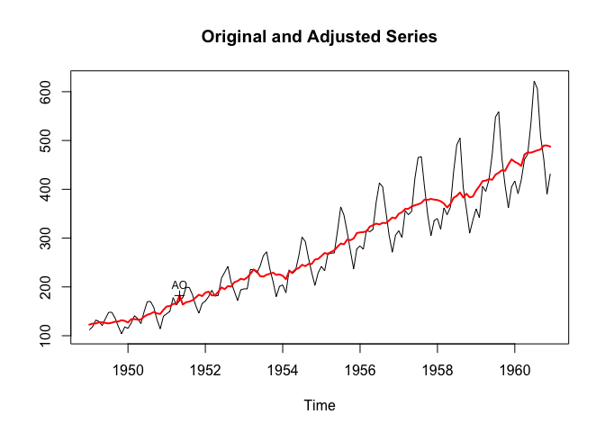
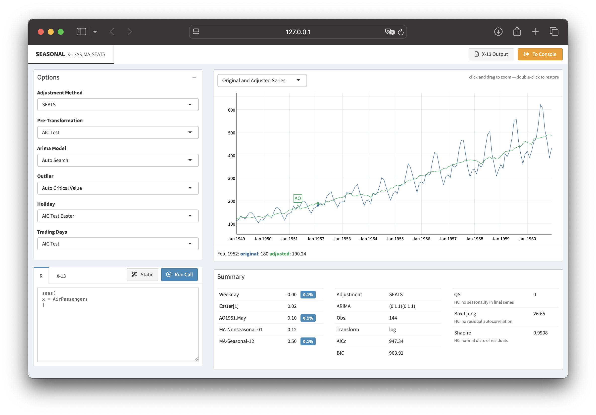

---
author:
- Christoph Sax
authors:
- Christoph Sax
badges:
- bg: bg-warning
  label: CRAN
categories:
- R
- time-series
date: 2024-10-21
excerpt: Time series data often display recurring seasonal patterns
  throughout the year. The R package seasonal provides a powerful and
  user-friendly way to perform seasonal adjustment in R, leveraging the
  X-13ARIMA-SEATS procedure developed by the U.S. Census Bureau.
image: seasonalview.png
layout: post
title: "seasonal 1.10: R-interface to X-13ARIMA-SEATS"
toc-title: Table of contents
---

We are happy to announce that the latest [CRAN
version](https://cran.r-project.org/package=seasonal) of *seasonal*
fixes several bugs and makes it easier to read specialized output from
X-13ARIMA-SEATS. See
[here](https://github.com/christophsax/seasonal/blob/main/NEWS.md#110)
for a complete list of changes. In addition, the accompanying
*seasonalview* package has been
[updated](https://cran.r-project.org/package=seasonalview) and finally
gets rid of some annoying warning messages.

## What is seasonal adjustment?

Time series data often display recurring seasonal patterns throughout
the year. For instance, unemployment rates in the United States
typically rise from January to March and again in June and July. By
applying seasonal adjustment, analysts can identify and remove these
predictable annual patterns, allowing for clearer interpretation of
fundamental changes in the data. The R package *seasonal* provides a
powerful and user-friendly way to perform this task in R, leveraging the
X-13ARIMA-SEATS procedure developed by the [U.S. Census
Bureau](https://www.census.gov/data/software/x13as.X-13ARIMA-SEATS.html).

## Getting started in R

To get started, use the `seas` function on any time series:

:::: cell
``` {.r .cell-code}
library(seasonal)
m <- seas(AirPassengers)
summary(m)
```

::: {.cell-output .cell-output-stdout}

    Call:
    seas(x = AirPassengers)

    Coefficients:
                        Estimate Std. Error z value Pr(>|z|)    
    Weekday           -0.0029497  0.0005232  -5.638 1.72e-08 ***
    Easter[1]          0.0177674  0.0071580   2.482   0.0131 *  
    AO1951.May         0.1001558  0.0204387   4.900 9.57e-07 ***
    MA-Nonseasonal-01  0.1156204  0.0858588   1.347   0.1781    
    MA-Seasonal-12     0.4973600  0.0774677   6.420 1.36e-10 ***
    ---
    Signif. codes:  0 '***' 0.001 '**' 0.01 '*' 0.05 '.' 0.1 ' ' 1

    SEATS adj.  ARIMA: (0 1 1)(0 1 1)  Obs.: 144  Transform: log
    AICc: 947.3, BIC: 963.9  QS (no seasonality in final):    0  
    Box-Ljung (no autocorr.): 26.65   Shapiro (normality): 0.9908  
:::
::::

By default, `seas` calls the automatic procedures of X-13ARIMA-SEATS to
perform a seasonal adjustment that works well in most circumstances.

To extract the final series, use the `final()` function:

::: cell
``` {.r .cell-code}
final(m)  
```
:::

To plot the results, use the `plot()` function:

:::: cell
``` {.r .cell-code}
plot(m)  
```

::: cell-output-display

:::
::::

## Input and output

In *seasonal*, it is possible to use the complete syntax of
X-13ARIMA-SEATS. The X-13ARIMA-SEATS syntax uses *specs* and
*arguments*, with each spec optionally containing some arguments. For
example, in order to set the 'variables' argument of the 'regression'
spec equal to `td` and `ao1999.jan`, the input to `seas` can be
specified like this:

::: cell
``` {.r .cell-code}
m <- seas(AirPassengers, regression.variables = c("td", "ao1955.jan"))
```
:::

*seasonal* has a flexible mechanism to read data from X-13ARIMA-SEATS.
With the `series` function, it is possible to extract any output that
can be generated by X-13ARIMA-SEATS. For example, the following command
returns the forecasts of the ARIMA model as a time series:

::: cell
``` {.r .cell-code}
m <- seas(AirPassengers)
series(m, "forecast.forecasts")
```
:::

## Graphical user interface

The *seasonalview* package provides a graphical user interface to
explore the results of the seasonal adjustment. Use the `view()`
function to open it:

::: cell
``` {.r .cell-code}
view(m)
```
:::



This interface allows for interactive exploration and adjustment of
seasonal models, making it easier to fine-tune your seasonal adjustments
and visualize the results.

## More information

For a more detailed introduction, check our [article in the *Journal of
Statistical Software*](https://doi.org/10.18637/jss.v087.i11) or visit
[the package website](http://www.seasonal.website). The package website
also allows you to upload your own data and explore the results
interactively.

You can report bugs, ask questions, or contribute to the development on
our [GitHub repository](https://github.com/christophsax/seasonal).
Thanks for using *seasonal*!
