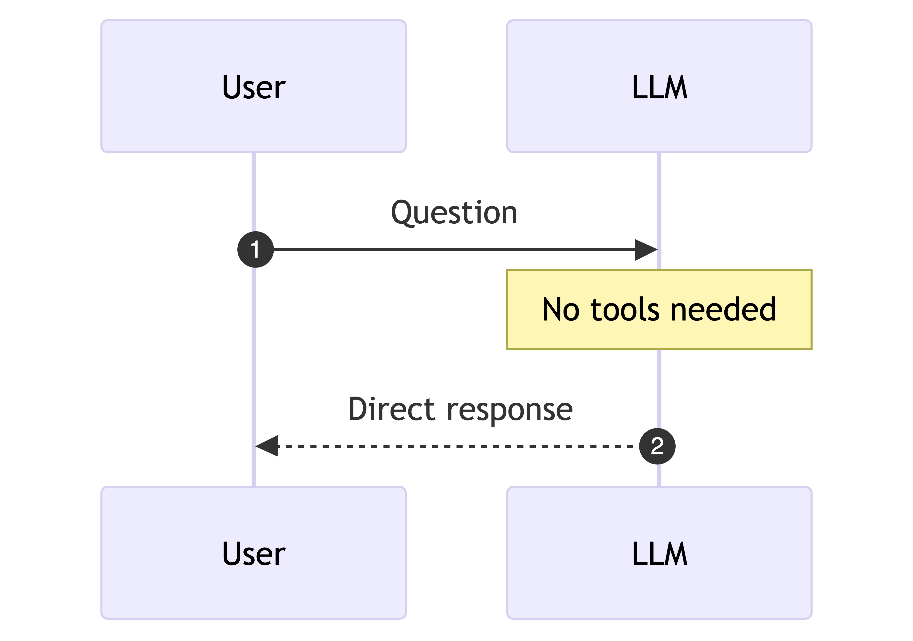
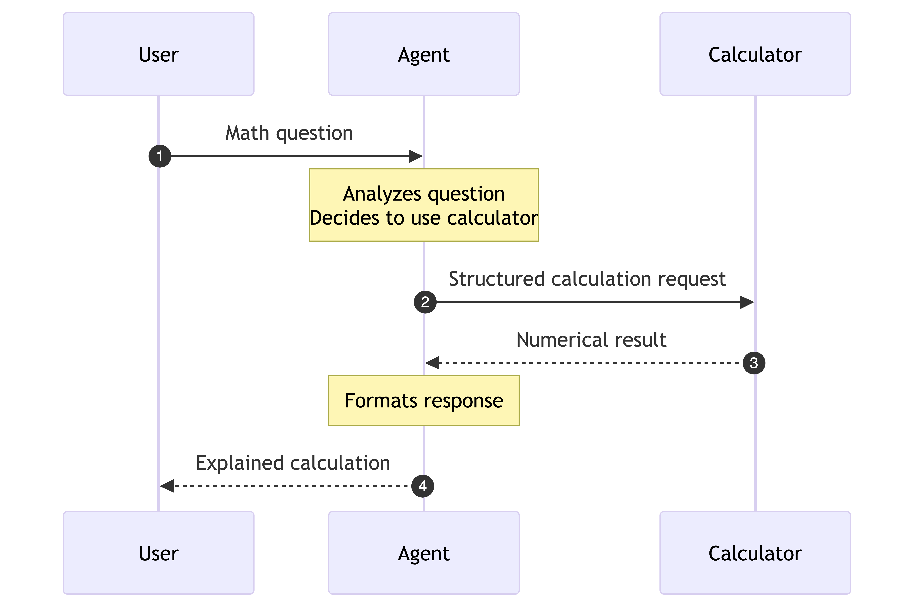
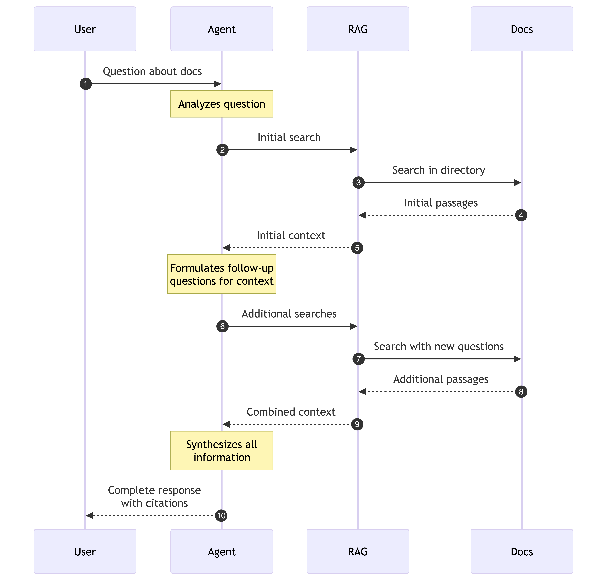

---
author:
- Christoph Sax
authors:
- Christoph Sax
categories:
- R
- LLM
date: 2025-02-07
excerpt: It's local LLM time! What an adventure it has been since I
  first started exploring local LLMs. With the introduction of various
  new Llama models, we now have impressive small and large models that
  run seamlessly on consumer hardware.
image: michael-dziedzic-aQYgUYwnCsM-unsplash.jpg
layout: post
title: Playing with AI Agents in R
toc-title: Table of contents
---

## Intro

It's local LLM time! 🥳 What an adventure it has been since I first
started [exploring local
LLMs](https://blog.cynkra.com/posts/2024-07-27-llama3.1/). With the
introduction of various new Llama models, we now have impressive small
and large models that run seamlessly on consumer hardware. With deepseek
R1, we have access to remarkably good MIT-licensed reasoning models that
rival the top models in the industry.

And now, we've got a fully-specced M4 Mac Mini for our office, which
runs all of this like a charm.

In this post, I will explore how we can use R to run agent models
[through Ollama](https://ollama.com).

## What is an agent?

Unlike normal chats, agents can use tools to do tasks. Tools are pieces
of software that can do anything, and it is up to the user to construct
the agentic workflow they want. With R, we have a powerful language to
configure these workflows and tell the tools what to do.

A typical agentic workflow looks like this:

1.  You tell an LLM what you want in plain English and the tools it has
    available
2.  The LLM figures out what tools it needs to use
3.  The agent uses the tools to get the job done
4.  Iterate, improve or continue with other tasks
5.  Let the LLM explain what it did

## R and Ollama

For the following experiments with agents, I'm using plain R and Ollama
(which you have to install first, but it's
[straightforward.](https://blog.cynkra.com/posts/2024-07-27-llama3.1/))

I know that there is the R package
[ellmer](https://ellmer.tidyverse.org), and you can do many things that
I am doing here with it. While [ellmer](https://ellmer.tidyverse.org) is
a great package, I prefer to work directly with the Ollama API. In my
opinion, this gives us more transparency into the agent mechanics.

My experiments with agents in R can be found in the
[ragent](https://github.com/cynkra/ragent) repository on GitHub. To
install the package, use:

``` r
remotes::install_github("cynkra/ragent")
```

I will use diagrams to show the conversation flow and the tools that are
used.

## A simple chat

Getting started is straightforward. In
[llm_chat()](https://github.com/cynkra/ragent/blob/main/R/llm_chat.R),
I've used the `httr2` package to wrap the Ollama API. You can use the
function to perform normal chats:

``` r
library(ragent)
llm_chat("What is the capital of France?")
#> Paris is the capital of France.
```


{width="4.69in"
height="3.29in"}


No surprise here: The user asks a question (1) and the LLM answers (2).
By default, I am using the
[`llama3.2:3b`](https://ollama.com/library/llama3.2) model, because it's
fast and good enough for this demo. But I can change it to any other,
more powerful model that Ollama supports. E.g,:

``` r
llm_chat("What is the capital of France?", model = "deepseek-r1:14b")
```

## Structured output

The ollama API supports structured output. We can use this to tell the
LLM to return a specific format. For example:

``` r
llm_chat("What is the capital of France?", format = list(
  type = "object",
  properties = list(
    country = list(type = "string"),
    capital = list(type = "string")
  ),
  required = c("country", "capital")
))
#> $country
#> [1] "France"
#>
#> $capital
#> [1] "Paris"
```

This structured response makes it easy to process the output
programmatically in R, as it will be automatically converted to a list
with named elements. It is often a good idea to add a system prompt to
guide the LLM to the desired output.

## A agent that can calculate

This is now a sweet setup for tinkering. We can use R to work with this
output to do more complex things.

Note that LLMs are not really good at calculating. The small Llama model
that I am using here messes this up:

``` r
llm_chat("What is 2.111^2.111")
#> [1] "To calculate this, we can use the formula for squaring a binomial:\n\n(a + b)^2 = a^2 + 2ab + b^2\n\nIn this case, a = 2 and b = 1.111.\n\nSo, \n\n(2 + 1.111)^2 = \n(3.111)^2 = 9.377226\n2*3.111 = 6.222442\n6.222442 + 9.377226 = 15.600668\n\nTherefore, 2.111^2.111 ≈ 15.60"
```

But we can tell the LLM to use a calculator tool to do the calculation
in R. The result [looks like
this](https://github.com/cynkra/ragent/blob/main/R/agent_calculator.R):

``` r
agent_calculator("What is 2.111^2.111")
#> **Calculation Result:** 2.111^2.111 = 4.84166414903285
```


{width="7.5in"
height="4.99in"}


Much better! This is an agent that:

1.  Analyzes the question
2.  Decides to use the calculator tool
3.  Uses the calculator tool to calculate the result in R
4.  Returns the response to the user

## A smarter RAG

A simple RAG (Retrieval Augmented Generation) enhances LLM responses by
first searching a knowledge base for relevant information. But our
improved RAG goes a step further: after the initial search, the LLM
formulates additional questions to gather more context, leading to more
comprehensive answers.

In [our smarter
RAG](https://github.com/cynkra/ragent/blob/main/R/agent_rag.R), we build
an agent that:

-   Search the knowledge base for relevant passages (2)
-   Ask the LLM to provide additional questions to search for (5)
-   Search the knowledge base for the additional questions (7)
-   Use the context to answer the question (10)


{width="9.29in"
height="8.89in"}


``` r
agent_rag("What is ggplot2 used for?", dir = "docs/")
#> Based on the documentation:
#> ggplot2 is a core package of the tidyverse used for visualization.
#> [Source: tidyverse.md]
```

This is just the beginning. We can build much more complex agents. For
example, we could create a general agent that combines both the
calculator and RAG capabilities. This agent would analyze each question
and automatically choose the right approach - either searching the
knowledge base or performing calculations.

## Conclusion

R is a powerful language for building AI agents. Its functional nature
makes tools feel like Lego bricks that we can combine. The way R handles
lists and data frames fits nicely with the JSON returned from the API,
and the rich R ecosystem provides everything we need to build powerful
agents. But what I found most useful is R's interactive workflow that
allows me to watch and debug the workings of the LLMs and the tools step
by step.
