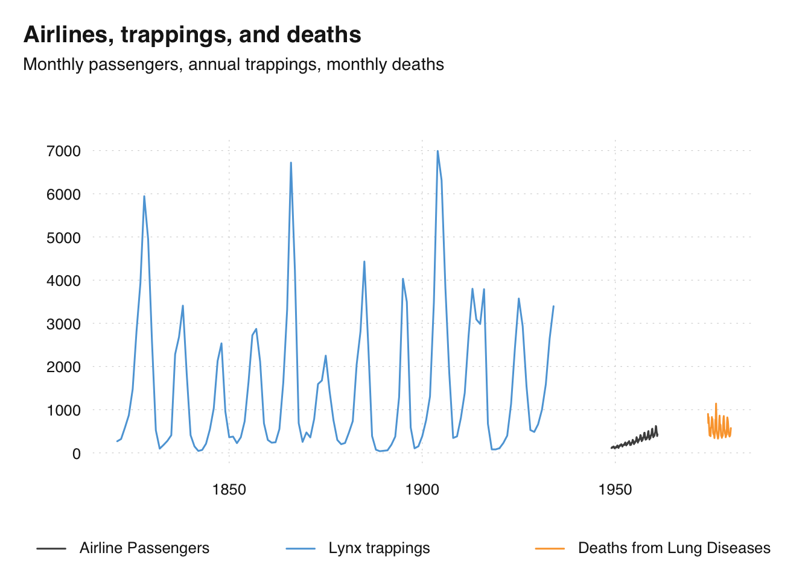

# Time series of the world, unite!
Christoph Sax
2018-05-15

The R ecosystem knows a ridiculous number of time series classes. So, I decided to create a new universal standard that finally covers everyone’s use case…

[Ok, just kidding!](https://xkcd.com/927)

[tsbox](https://www.tsbox.help/), just realeased on [CRAN](https://cran.r-project.org/package=tsbox), provides a set of tools that are agnostic towards existing time series classes. It is built around a set of converters, which convert time series stored as [ts](https://www.rdocumentation.org/packages/stats/versions/3.5.0/topics/ts), [xts](https://cran.r-project.org/package=xts), [data.frame](https://rdrr.io/r/base/data.frame.html), [data.table](https://cran.r-project.org/package=data.table), [tibble](http://tibble.tidyverse.org/), [zoo](https://cran.r-project.org/package=zoo), [tsibble](https://tsibble.tidyverts.org/) or [timeSeries](https://cran.r-project.org/package=timeSeries) to each other.

To install the stable version from CRAN:

``` r
install.packages("tsbox")
```

To get an idea how easy it is to switch from one class to another, consider this:

``` r
library(tsbox)
x.ts <- ts_c(mdeaths, fdeaths)
x.xts <- ts_xts(x.ts)
x.df <- ts_df(x.xts)
x.tbl <- ts_tbl(x.df)
x.dt <- ts_tbl(x.tbl)
x.zoo <- ts_zoo(x.dt)
x.tsibble <- ts_tsibble(x.zoo)
x.timeSeries <- ts_timeSeries(x.tsibble)
```

We jump form good old `ts` objects to`xts`, store our time series in various data frames and convert them to some highly specialized time series formats.

### tsbox is class-agnostic

Because these converters work nicely, we can use them to make functions class-agnostic. If a class-agnostic function works for one class, it works for all:

``` r
ts_scale(x.ts)
ts_scale(x.xts)
ts_scale(x.df)
ts_scale(x.dt)
ts_scale(x.tbl)
```

`ts_scale` normalizes one or multiple series, by subtracting the mean and dividing by the standard deviation. It works like a ‘generic’ function: You can apply it on any time series object, and it will return an object of the same class as its input.

So, whether we want to smooth, scale, differentiate, chain-link, forecast, regularize, or seasonally adjust a series, we can use the same commands to whatever time series at hand. tsbox offers a comprehensive toolkit for the basics of time series manipulation. Here are some additional operations:

``` r
ts_pc(x.ts)                 # percentage change rates
ts_forecast(x.xts)          # forecast, by exponential smoothing
ts_seas(x.df)               # seasonal adjustment, by X-13
ts_frequency(x.dt, "year")  # convert to annual frequency
ts_span(x.tbl, "-1 year")   # limit time span to final year
```

### tsbox is frequency-agnostic

There are many more. Because they all start with `ts_`, you can use auto-complete to see what’s around. Most conveniently, there is a time series plot function that works for all classes and frequencies:

``` r
ts_plot(
  `Airline Passengers` = AirPassengers,
  `Lynx trappings` = ts_df(lynx),
  `Deaths from Lung Diseases` = ts_xts(fdeaths),
  title = "Airlines, trappings, and deaths",
  subtitle = "Monthly passengers, annual trappings, monthly deaths"
)
```



There is also a version that uses [ggplot2](https://CRAN.R-project.org/package=ggplot2) and has the same syntax.

### Time series in data frames

You may have wondered why we treated data frames as a time series class. The spread of [dplyr](https://CRAN.R-project.org/package=dplyr) and [data.table](https://CRAN.R-project.org/package=data.table) has given data frames a boost and made them one of the most popular data structures in R. So, storing time series in a data frame is an obvious consequence. And even if you don’t intend to keep time series in data frames, this is still the format in which you import and export your data. tsbox makes it easy to switch from data frames to time series and back.

### Make existing functions class-agnostic

tsbox includes [tools](https://www.tsbox.help/articles/ts-functions.html) to make existing functions class-agnostic. To do so, the `ts_` function can be used to wrap any function that works with time series. For a function that works on `"ts"` objects, this is as simple as that:

``` r
ts_rowsums <- ts_(rowSums)
ts_rowsums(ts_c(mdeaths, fdeaths))
```

Note that `ts_` returns a function, which can be used with or without a name.

In case you are wondering, tsbox uses [data.table](https://CRAN.R-project.org/package=data.table) as a backend and makes use of its incredibly efficient reshaping facilities, its joins, and rolling joins. And thanks to [anytime](https://cran.r-project.org/package=anytime), tsbox will be able to recognize almost any date format without manual intervention.

So, if you’ve been struggling with R’s time series class, we hope that you found this blog helpful.

Website: [www.tsbox.help](https://www.tsbox.help)
