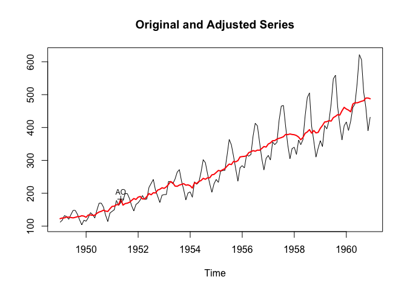
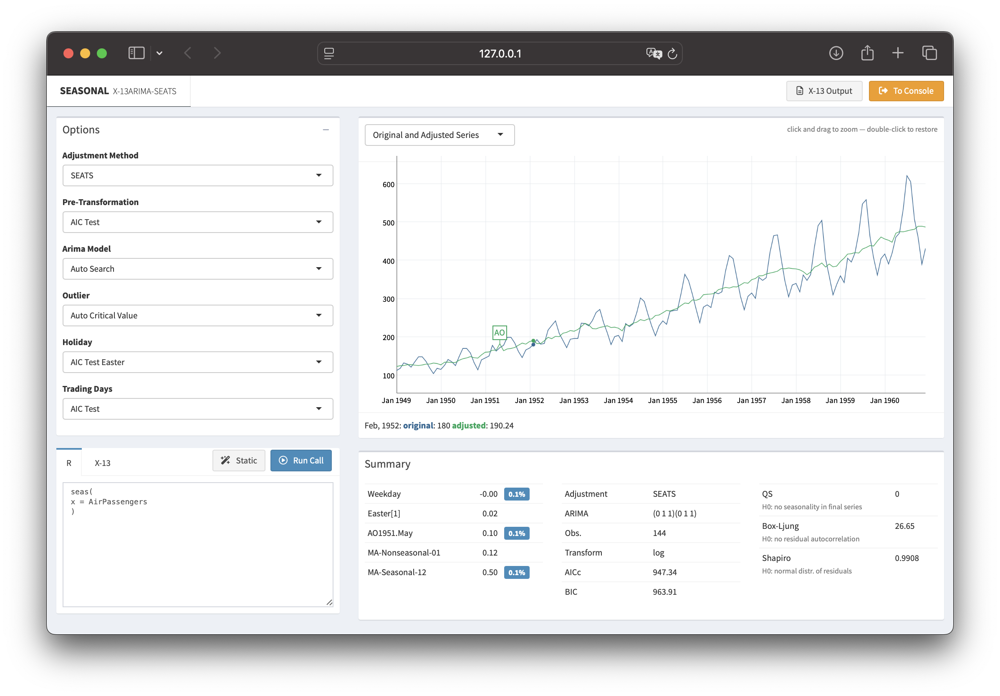

# seasonal 1.10: R-interface to X-13ARIMA-SEATS
Christoph Sax
2024-10-21

We are happy to announce that the latest [CRAN version](https://cran.r-project.org/package=seasonal) of *seasonal* fixes several bugs and makes it easier to read specialized output from X-13ARIMA-SEATS. See [here](https://github.com/christophsax/seasonal/blob/main/NEWS.md#110) for a complete list of changes. In addition, the accompanying *seasonalview* package has been [updated](https://cran.r-project.org/package=seasonalview) and finally gets rid of some annoying warning messages.

## What is seasonal adjustment?

Time series data often display recurring seasonal patterns throughout the year. For instance, unemployment rates in the United States typically rise from January to March and again in June and July. By applying seasonal adjustment, analysts can identify and remove these predictable annual patterns, allowing for clearer interpretation of fundamental changes in the data. The R package *seasonal* provides a powerful and user-friendly way to perform this task in R, leveraging the X-13ARIMA-SEATS procedure developed by the [U.S. Census Bureau](https://www.census.gov/data/software/x13as.X-13ARIMA-SEATS.html).

## Getting started in R

To get started, use the `seas` function on any time series:

``` r
library(seasonal)
m <- seas(AirPassengers)
summary(m)
```


    Call:
    seas(x = AirPassengers)

    Coefficients:
                        Estimate Std. Error z value Pr(>|z|)    
    Weekday           -0.0029497  0.0005232  -5.638 1.72e-08 ***
    Easter[1]          0.0177674  0.0071580   2.482   0.0131 *  
    AO1951.May         0.1001558  0.0204387   4.900 9.57e-07 ***
    MA-Nonseasonal-01  0.1156204  0.0858588   1.347   0.1781    
    MA-Seasonal-12     0.4973600  0.0774677   6.420 1.36e-10 ***
    ---
    Signif. codes:  0 '***' 0.001 '**' 0.01 '*' 0.05 '.' 0.1 ' ' 1

    SEATS adj.  ARIMA: (0 1 1)(0 1 1)  Obs.: 144  Transform: log
    AICc: 947.3, BIC: 963.9  QS (no seasonality in final):    0  
    Box-Ljung (no autocorr.): 26.65   Shapiro (normality): 0.9908  

By default, `seas` calls the automatic procedures of X-13ARIMA-SEATS to perform a seasonal adjustment that works well in most circumstances.

To extract the final series, use the `final()` function:

``` r
final(m)  
```

To plot the results, use the `plot()` function:

``` r
plot(m)  
```



## Input and output

In *seasonal*, it is possible to use the complete syntax of X-13ARIMA-SEATS. The X-13ARIMA-SEATS syntax uses *specs* and *arguments*, with each spec optionally containing some arguments. For example, in order to set the ‘variables’ argument of the ‘regression’ spec equal to `td` and `ao1999.jan`, the input to `seas` can be specified like this:

``` r
m <- seas(AirPassengers, regression.variables = c("td", "ao1955.jan"))
```

*seasonal* has a flexible mechanism to read data from X-13ARIMA-SEATS. With the `series` function, it is possible to extract any output that can be generated by X-13ARIMA-SEATS. For example, the following command returns the forecasts of the ARIMA model as a time series:

``` r
m <- seas(AirPassengers)
series(m, "forecast.forecasts")
```

## Graphical user interface

The *seasonalview* package provides a graphical user interface to explore the results of the seasonal adjustment. Use the `view()` function to open it:

``` r
view(m)
```



This interface allows for interactive exploration and adjustment of seasonal models, making it easier to fine-tune your seasonal adjustments and visualize the results.

## More information

For a more detailed introduction, check our [article in the *Journal of Statistical Software*](https://doi.org/10.18637/jss.v087.i11) or visit [the package website](http://www.seasonal.website). The package website also allows you to upload your own data and explore the results interactively.

You can report bugs, ask questions, or contribute to the development on our [GitHub repository](https://github.com/christophsax/seasonal). Thanks for using *seasonal*!
